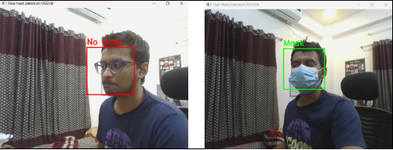
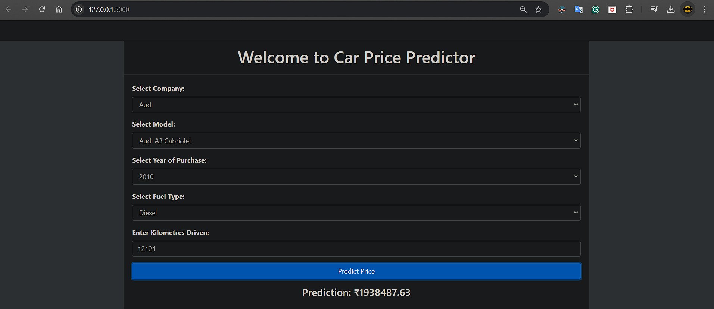
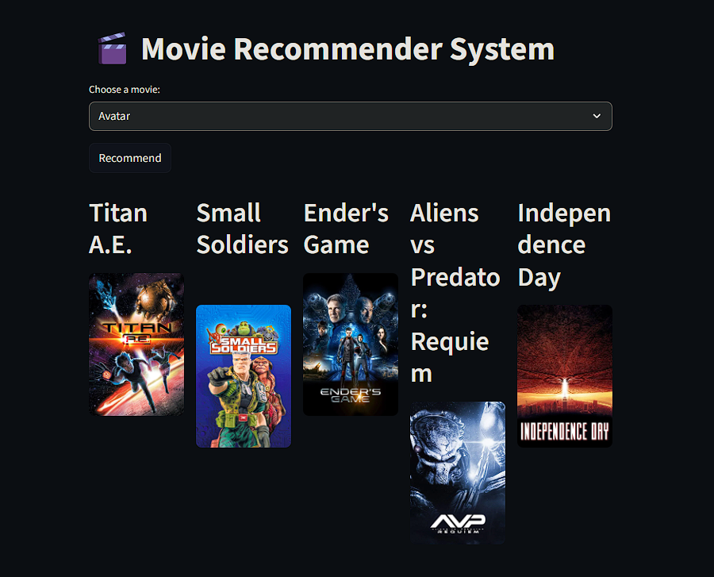
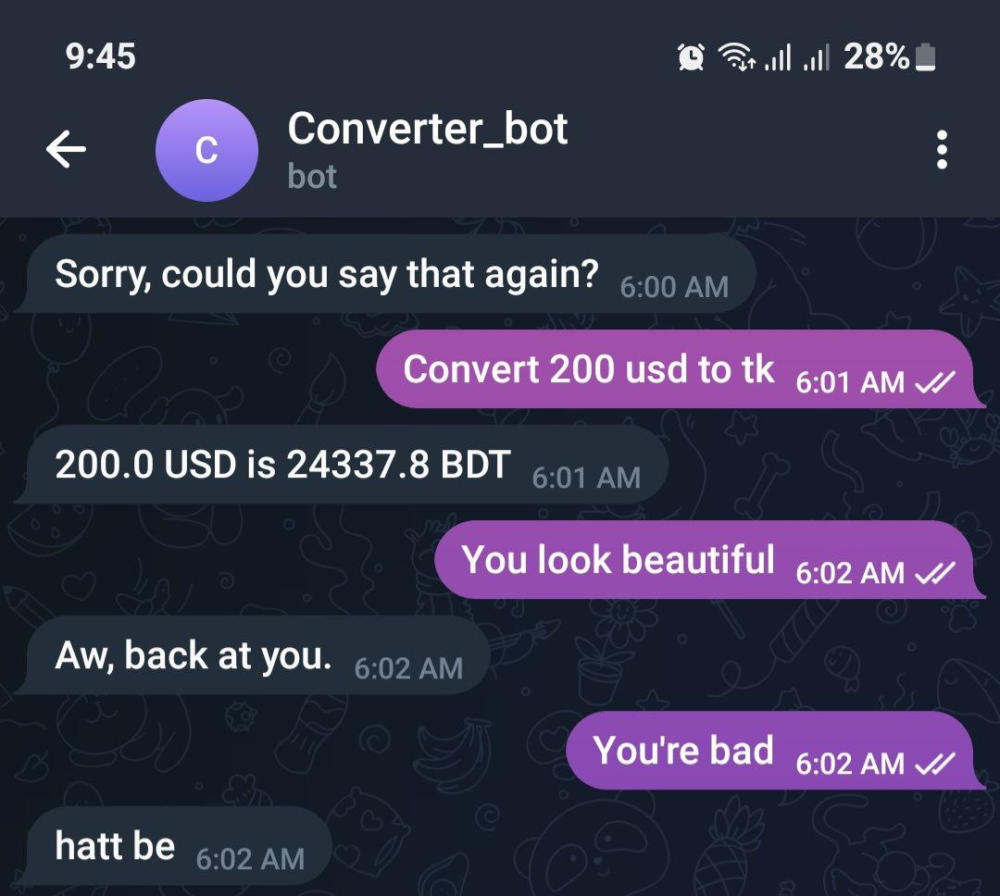
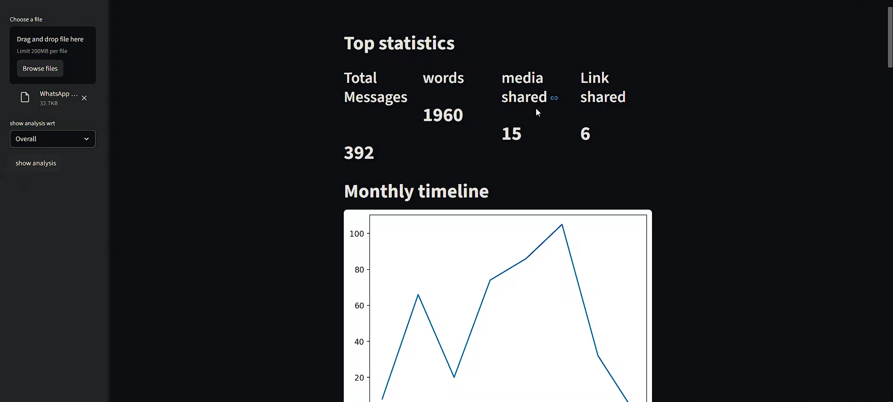
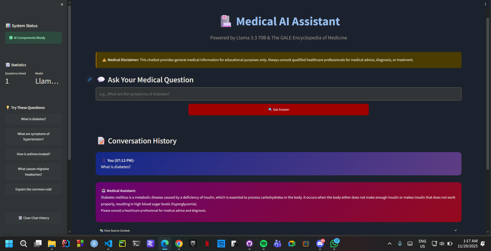
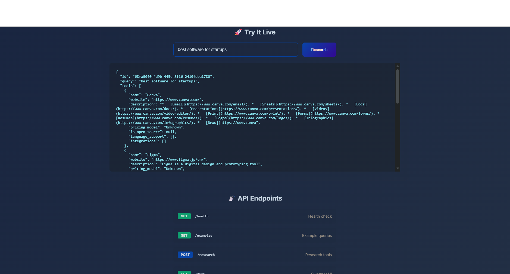
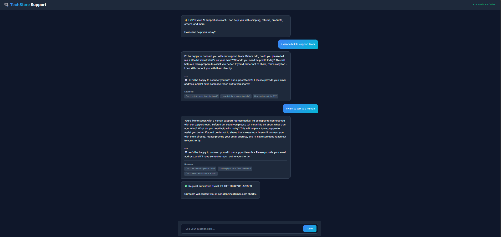
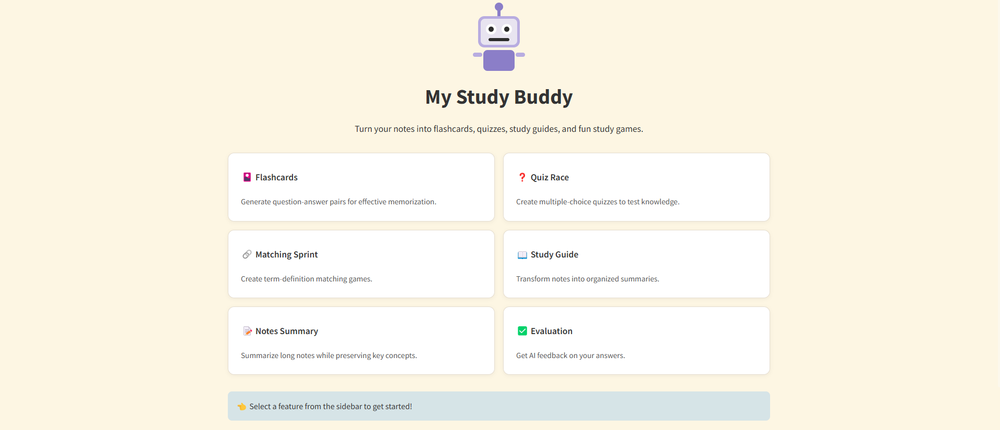
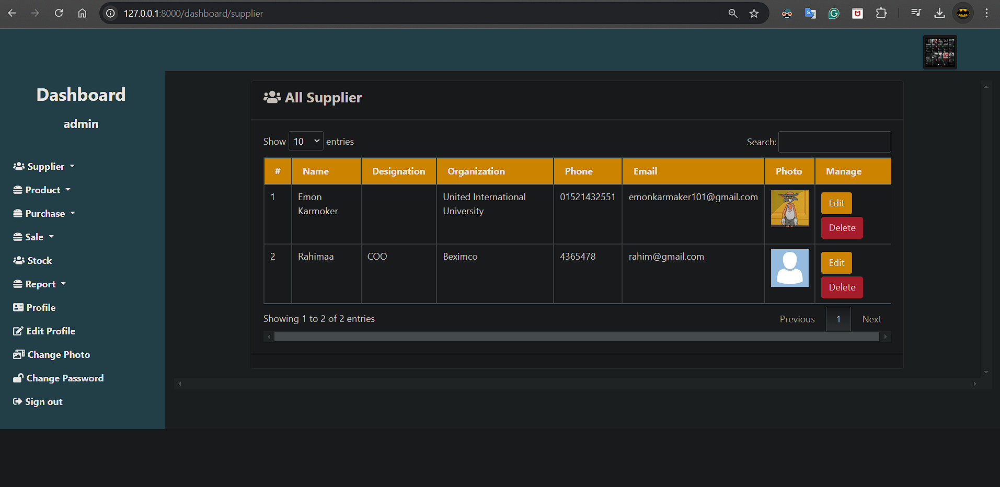

<h1 align="center">
  
</h1>

  
  
  
  
  
  

  

## 🚀 Professional Summary

Computer Science graduate with strong expertise in Machine Learning, Deep Learning, and Agentic AI systems, specializing in Python-based AI development. 
Experienced in building LLM-powered applications and AI agents using FastAPI, LangGraph, LangChain, and workflow automation tools like n8n. Proficient in 
TensorFlow, Keras, PyTorch, and Scikit-learn, with hands-on experience deploying scalable AI systems using Docker and cloud platforms. Skilled in SQL and 
Power BI for data analysis and visualization. Currently working as an AI Engineer at Betopia.

---

## 💻 Tech Stack

### **Programming Languages**

### **Machine Learning & AI**

### **Data & Analytics**

### **Tools & Platforms**

---

## 🏆 Featured Projects

### 🔬 **sCMGC: Single-Cell RNA-Seq Clustering**
*Unified deep learning framework for marker gene-based clustering* 
🥈 **1st Runner Up** - UIU Project Show Competition 
**Tech**: Python, TensorFlow, Deep Learning, Bioinformatics 
Advanced clustering accuracy by 40% vs traditional methods

 

  

### 👨‍🏫 **Teaching Assistant Recruitment System**
*Database-backed decision-making system for TA selection* 
🥉 **2nd Runner Up** - UIU Project Show Competition 
**Tech**: Web Application, Database Design, Decision Systems 
Streamlined recruitment for 112+ students

 

  

### 🏥 **Deep Learning-Enhanced OCT Image Analysis Pipeline: Integrating Denoising, Super-Resolution, and Fuzzy Logic for Improved Clinical Diagnostics**
*Medical imaging pipeline for disease classification* 
**Accepted at ICDSAIA 2025** 
**Tech**: Python, OpenCV, CNN, Fuzzy Logic 
Trained a CNN in TensorFlow/Keras achieving 99% B-scan and 92% volume accuracy on a clinical OCT dataset, running 32% faster than baselines.
🔗 **Publication**:  
[SpringerLink – ICDSAIA 2025 Proceedings](https://link.springer.com/10.1007/978-3-032-11335-1_19)

  
### 🏥 **A Deep Learning Based Approach to Identify Colon Cancer  from Endoscopic Images**
*Benchmarked GoogLeNet, ResNet, and YOLOv8 on the Kvasir-SEG dataset using uniform preprocessing* 
**Accepted at 4th IEEE BECITHCON 2025** 
**Tech**: GoogLeNet, ResNet, and YOLOv8 
Evaluated accuracy, precision, recall, F1, finding YOLOv8 highest at 97.5%, outperforming ResNet (93.7%) and GoogLeNet (90.6%) for colorectal 
polyp detection

---

## 📊 Project Portfolio

### 🤖 **AI & Computer Vision**

| | |
|:---:|:---:|
|  |  |
| **Posture Detection**  | **Face Mask Detector**  |

### 📈 **Machine Learning**

| | |
|:---:|:---:|
|  |  |
| **Car Price Prediction**  | **Movie Recommendation**  |

### 💬 **NLP & Analytics**

| | |
|:---:|:---:|
|  |  |
| **Chatbot**  | **WhatsApp Analytics**  |

 

### 🚀 **LLM Applications & Agentic AI Systems**

| | |
|:---:|:---:|
|  |  |
| **Semantic Book Recommender**  | **Medical Chatbot – AI Health Assistant**  |

</table>

 

| | |
|:---:|:---:|
|  |  |
| **Autonomous AI Agent – Web Research & Task Execution**  | **AI Customer Support System**  <a href="https://github.com/EmonKarmaker/ai-support-system">

| |
|:---:|
|  |
| **AI Study Engine – Smart Learning Platform** 
 

🔗 **Live Book Recommender:** https://huggingface.co/spaces/EdwardConstantine/book-recommender  
📁 **Book Recommender Repo:** https://github.com/EmonKarmaker/book_reccomender-2.0  

🔗 **Live Medical Chatbot:** https://medical-chatbot-2-0-xz3n.onrender.com/  
📁 **Medical Chatbot Repo:** https://github.com/EmonKarmaker/medical-chatbot-2.0  

🔗 **Live AI Agent:** https://ai-agent-1-53gg.onrender.com/  
📁 **AI Agent Repo:** https://github.com/EmonKarmaker/AI-agent  

🔗 **AI Study Engine Live Demo:** https://ai-study-engine.onrender.com/  
📁 **AI Study Engine GitHub Repo:** https://github.com/EmonKarmaker/ai-study-engine

🏪 𝗪𝗲𝗯 𝗗𝗲𝘃𝗲𝗹𝗼𝗽𝗺𝗲𝗻𝘁

| |
|:---:|
|  |
| **Pharmacy Management**  |

---
## 📈 GitHub Analytics

  

  

---

## 🎓 Education & Experience

### **B.Sc Computer Science & Engineering**
**United International University** | *2020 – 2025* 

 

### 💼 **Professional Experience**
**Grader – Fundamental Calculus** | *United International University* 
*Mar 2023 – Jun 2023* 
Supported academic assessment and guided students in foundational mathematical concepts.

 

**Deputy of Public Relations** | *UIU Computer Club* 
*May 2022 – Jun 2023* 
Managed collaborations, promoted technical events, and led communications initiatives.

 

**Campus Ambassador** | *Youth Opportunities* 
*Jan 2023 – Dec 2023* 
Represented platform activities, built engagement strategies, and supported youth empowerment programs.

---

## 📚 Courses & Certifications

### **Data Engineer with Python & Machine Learning**
**Center For Development of IT Professionals (CDIP), UIU** | *2024 – 2025* 
Mastered essential skills in Python, data pipelines, and machine learning for expert data handling and analysis.

 

### **Introduction to Python and Big Data Analysis**
**Center For Development of IT Professionals (CDIP), UIU** | *2023 – 2024* 
Comprehensive training in Python programming and big data analysis techniques.

 

### **Graphics Design (CTG-106)**
**CodersTrust** | *2020* 
Professional graphics design training and certification.

 

### **Computer Basic and ICT Application Course**
**Youth Development** | *Jan-June 2020* 
Fundamental computer and ICT skills development program.

 

---

## 🔗 Let's Connect

  
  
  
  
  
  
  
  
  
  
  

  

