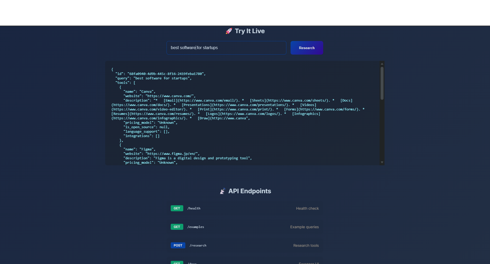
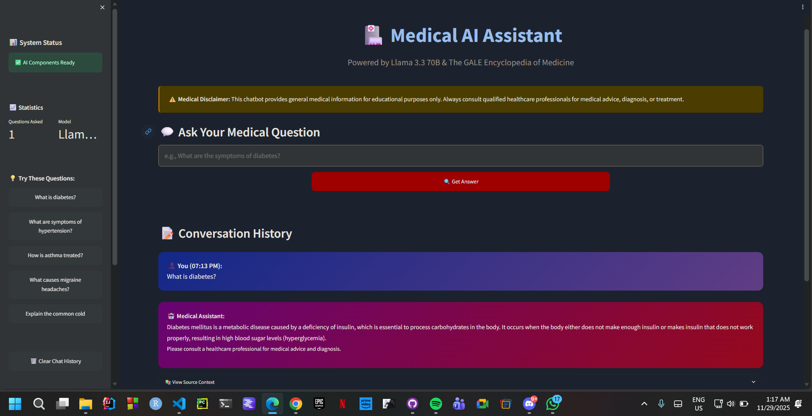
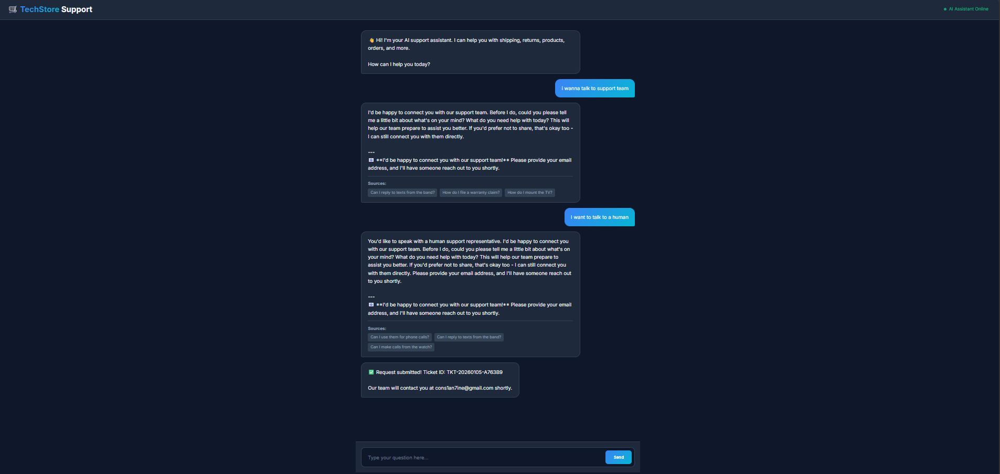
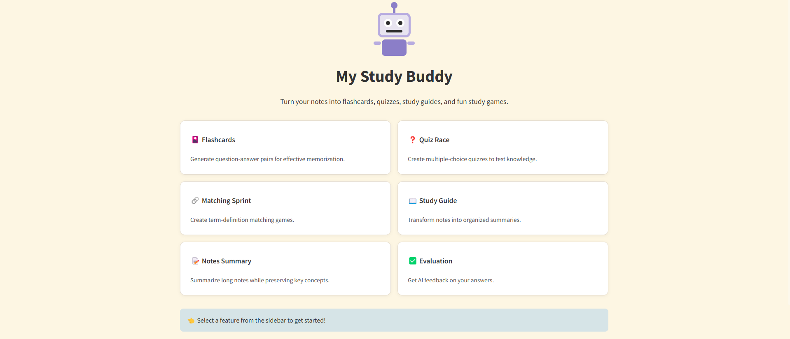
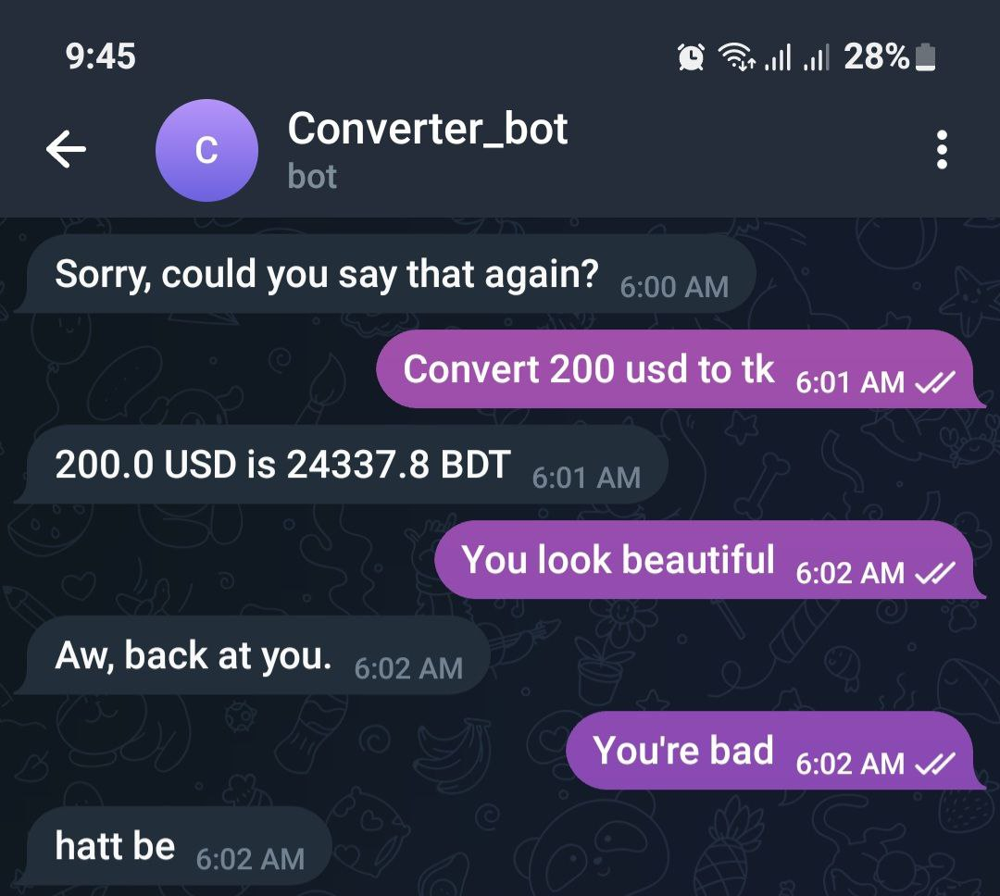
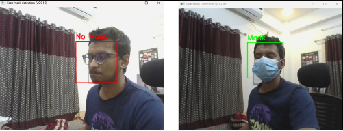
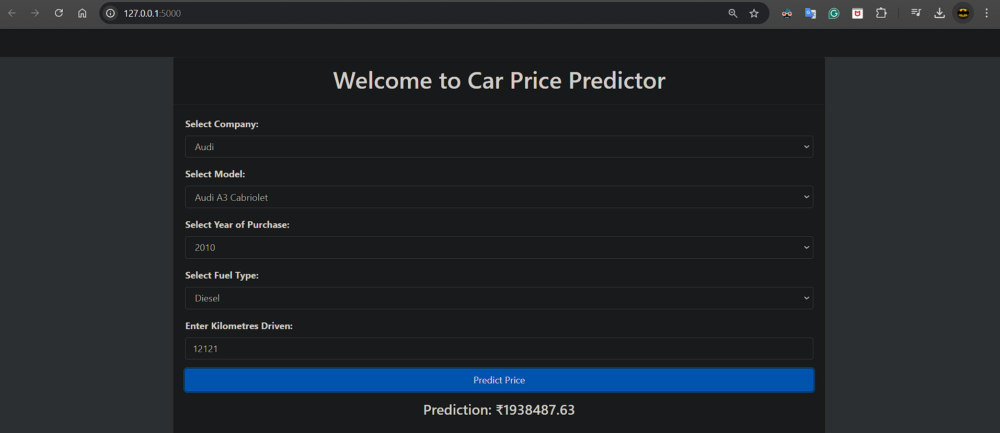
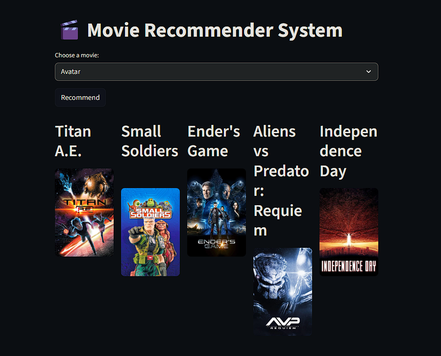
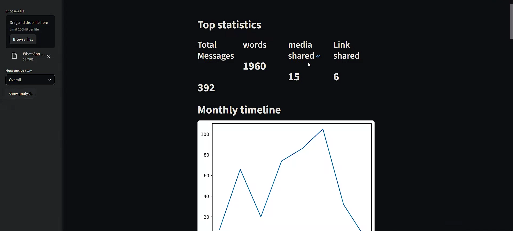
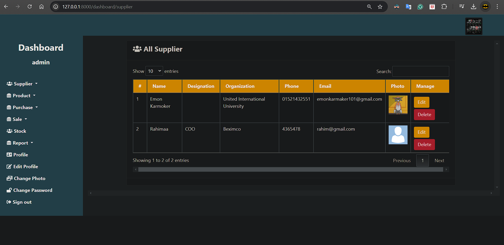

<h1 align="center">
  
</h1>

  
  
  
  
  
  
  

  

## 🚀 Professional Summary

Computer Science graduate with strong expertise in **Machine Learning, Deep Learning, and Agentic AI systems**, specializing in Python-based AI development.
Experienced in building **LLM-powered applications and AI agents** using FastAPI, LangGraph, LangChain, and workflow automation tools like n8n. Proficient in
TensorFlow, Keras, PyTorch, and Scikit-learn, with hands-on experience deploying scalable AI systems using Docker and cloud platforms. Skilled in PostgreSQL (with pgvector), SQL, and
Power BI for data analysis and visualization. **2× IEEE-accepted publications** in healthcare AI.
Previously worked as an **AI Backend Developer at Beuptech Agency** (a concern of Betopia Group). Currently a **Software Engineer at Roaming Bangladesh Limited**.

---

## 💻 Tech Stack

### **Programming Languages**

### **Machine Learning, Deep Learning & LLM Systems**

### **Backend, APIs & Automation**

### **Frontend**

### **Data & Vector Stores**

### **Tools & Platforms**

---

## 📝 Research & Publications

### 🏥 **Deep Learning-Enhanced OCT Image Analysis Pipeline**
*Integrating Denoising, Super-Resolution, and Fuzzy Logic for Improved Clinical Diagnostics* 
**Accepted at ICDSAIA 2025** &nbsp;|&nbsp; **Tech**: Python, OpenCV, CNN, ESRGAN, Fuzzy Logic 
Built an OCT pipeline with noise reduction, LAB-based fuzzy contrast enhancement, and ESRGAN super-resolution. Trained a CNN in TensorFlow/Keras achieving **99% B-scan** and **92% volume accuracy**, running **32% faster** than baselines. 
🔗 [SpringerLink – ICDSAIA 2025 Proceedings](https://link.springer.com/10.1007/978-3-032-11335-1_19)

 

### 🏥 **A Deep Learning Based Approach to Identify Colon Cancer from Endoscopic Images**
**Published at 4th IEEE BECITHCON 2025** &nbsp;|&nbsp; **Tech**: GoogLeNet, ResNet, YOLOv8 
Benchmarked GoogLeNet, ResNet, and YOLOv8 on the Kvasir-SEG dataset using uniform preprocessing. Evaluated accuracy, precision, recall, and F1 — finding **YOLOv8 highest at 97.5%**, outperforming ResNet (93.7%) and GoogLeNet (90.6%) for colorectal polyp detection. 
🔗 [IEEE Xplore – Paper](https://ieeexplore.ieee.org/abstract/document/11504178)

---

## 🏆 Featured Projects

### 🔬 **sCMGC: Single-Cell RNA-Seq Clustering**
*Unified deep learning framework for marker gene-based clustering* 
🥈 **1st Runner Up** - UIU Project Show Competition 
**Tech**: Python, TensorFlow, Deep Learning, Bioinformatics 
Advanced clustering accuracy by 40% vs traditional methods

 

  

### 👨‍🏫 **Teaching Assistant Recruitment System**
*Database-backed decision-making system for TA selection* 
🥉 **2nd Runner Up** - UIU Project Show Competition 
**Tech**: Web Application, Database Design, Decision Systems 
Streamlined recruitment for 112+ students

 

---

## 📊 Project Portfolio

### 🧠 **Flagship — Multi-Tenant Agentic AI Platform**

| | |
|:---:|:---:|
|  |  |
| **AI Reservation SaaS** — Multi-tenant AI receptionist for service businesses (chat + voice bookings)  | **Autonomous AI Agent** — Web Research & Task Execution  |

> **AI Reservation SaaS** — a multi-tenant AI receptionist platform for service businesses (dental, HVAC, law). Built with FastAPI + async SQLAlchemy 2 + PostgreSQL 16 (Supabase) + a 23-node **LangGraph** state machine, pgvector semantic search, Groq, Stripe, Vapi (voice) and Resend. Features a 17-table schema, a 7-layer booking verification pipeline, and 65+ API endpoints. Frontend in Next.js 16 + Tailwind v4 + shadcn/ui.

 

### 🚀 **LLM Applications & Agentic AI Systems**

| | |
|:---:|:---:|
|  |  |
| **Semantic Book Recommender**  | **Medical Chatbot – AI Health Assistant**  |
|  |  |
| **AI Customer Support System**  | **AI Study Engine – Smart Learning Platform**  |
|  |  |
| **n8n AI Email Response System** — Slack human-in-the-loop approval  | **Chatbot**  |

 

### 🎙️ **Speech & Language (ASR / Fine-Tuning)**

| | |
|:---:|:---:|
|  |  |
| **Bilingual Bangla-English ASR** — fine-tuned Whisper-small  | **Quran Recitation Evaluation** — FastAPI + Whisper + WebSocket  |
|  | |
| **LLaMA 3.1-8B Fine-Tune** — Bengali empathetic conversations (LoRA, 4-bit)  | |

 

### 🤖 **AI & Computer Vision**

| | |
|:---:|:---:|
|  |  |
| **Posture Detection**  | **Face Mask Detector**  |

 

### 📈 **Machine Learning & Analytics**

| | |
|:---:|:---:|
|  |  |
| **Car Price Prediction**  | **Movie Recommendation**  |
|  | |
| **WhatsApp Chat Analytics**  | |

 

### 🏪 **Web Development**

| | |
|:---:|:---:|
|  |  |
| **HomieGhor** — Household expense tracker (FastAPI + Next.js)  | **Pharmacy Management**  |

 

### 🌐 Live Demos — Try Them Out

---

## 📈 GitHub Analytics

  

  

---

## 🎓 Education & Experience

### **B.Sc Computer Science & Engineering**
**United International University** | *2020 – 2025*

 

### 💼 **Professional Experience**

**Software Engineer** | *Roaming Bangladesh Limited* 
*June 2026 – Present* 
Full-stack development for a B2B travel-tech platform: pixel-accurate Figma-to-Next.js/TypeScript/Tailwind frontends, FastAPI REST APIs, PostgreSQL + pgvector for semantic search, and AI features via LangGraph and RAG pipelines.

 

**AI Backend Developer** | *Beuptech Agency (a concern of Betopia Group)* 
*January 2026 – April 2026* 
Built LLM-powered backend services and AI agents.

 

**Grader – Fundamental Calculus** | *United International University* 
*Mar 2023 – Jun 2023* 
Supported academic assessment and guided students in foundational mathematical concepts.

 

**Deputy of Public Relations** | *UIU Computer Club* 
*May 2022 – Jun 2023* 
Managed collaborations, promoted technical events, and led communications initiatives.

 

**Campus Ambassador** | *Youth Opportunities* 
*Jan 2023 – Dec 2023* 
Represented platform activities, built engagement strategies, and supported youth empowerment programs.

---

## 📚 Courses & Certifications

### **Data Engineer with Python & Machine Learning**
**Center For Development of IT Professionals (CDIP), UIU** | *2024 – 2025* 
Mastered essential skills in Python, data pipelines, and machine learning for expert data handling and analysis.

 

### **Introduction to Python and Big Data Analysis**
**Center For Development of IT Professionals (CDIP), UIU** | *2023 – 2024* 
Comprehensive training in Python programming and big data analysis techniques.

 

### **Graphics Design (CTG-106)**
**CodersTrust** | *2020* 
Professional graphics design training and certification.

 

### **Computer Basic and ICT Application Course**
**Youth Development** | *Jan-June 2020* 
Fundamental computer and ICT skills development program.

 

---

## 🔗 Let's Connect

  
  
  
  
  
  
  
  
  
  
  

